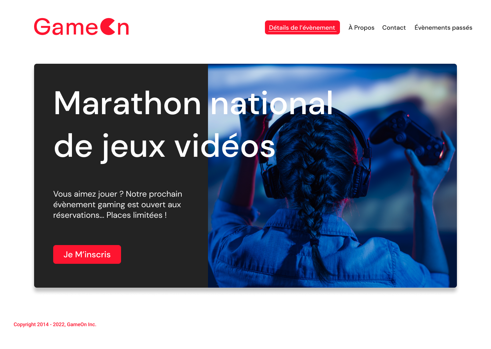

<a name="readme-top"></a>
<!-- PROJECT LOGO -->
<br />
<div align="center">
  <a href="https://github.com/AurelieDuynslaeger/GameOn-Project4-OCR">
    
  </a>

<!-- TABLE OF CONTENTS -->
<details>
  <summary>Table des matières</summary>
  <ol>
    <li><a href="#a-propos-du-projet">À propos du projet</a></li>
    <li><a href="#langagesutilises">langages Utilisés</a></li>
    <li><a href="#missions">Missions</a></li>
    <li><a href="#installation">Installation</a></li>
    <li><a href="#contact">Contact</a></li>
  </ol>
</details>


<!-- ABOUT THE PROJECT -->
## À propos du projet

Game On est le projet 4 de ma formation OpenClassroom.
GameOn est spécialisée dans les conférences et les concours de jeux.

La mission principale était donc de réaliser un formulaire avec JavaScript pur, sans l'utilisation de bibliothèques ou de frameworks. Travailler sur sa validation, les données saisies, la gestion des erreurs selon les critères établis. 

Gestion des event JS pour créer une intéraction dynamique avec les users !

 

## Langages utilisés


## Missions

* Events JavaScript Vanilla
* responsive design 


## Installation

1. Clonez le repository de l'application
   ```sh
   git clone https://github.com/AurelieDuynslaeger/GameOn-Project4-OCR.git
   ```

2. Lancez l'application avec Live Server !
  
## Contact

Aurélie D. - [GitHub](https://github.com/AurelieDuynslaeger/)

<!-- MARKDOWN LINKS & IMAGES -->

[html.com]: https://img.shields.io/badge/-HTML-f06529?style=flat&logo=html5&logoColor=fff
[html-url]: https://html.com/
[css.com]: https://img.shields.io/badge/-CSS-264de4?style=flat&logo=css3&logoColor=fff
[css-url]: https://www.w3.org/Style/CSS/
[javascript.com]: https://img.shields.io/badge/-JavaScript-f6ff00?logo=JavaScript&logoColor=fff
[javascript-url]: https://www.javascript.com/


